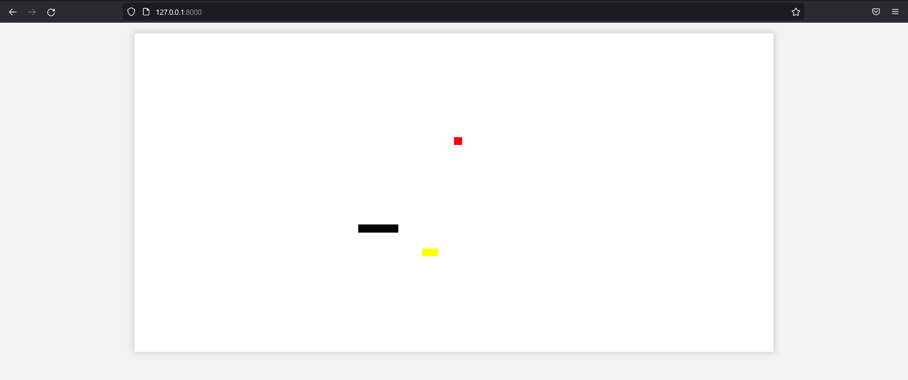

# Classic python multiplayer snake

The game consists of rooms where python processes the game every time interval.
Everything is written with Django>4.0 and Django Channels.

The game presents an opportunity to play it with a different number of players.

At this point in time, the front-end side is made in plain HTML, without canvas, which is bad.

# To run it you need the following 
```git clone https://github.com/batr1der/snake_multiplayer
pip install -r requirements.txt
python manage.py migrate
python manage.py runserver
```
# Example in the image

